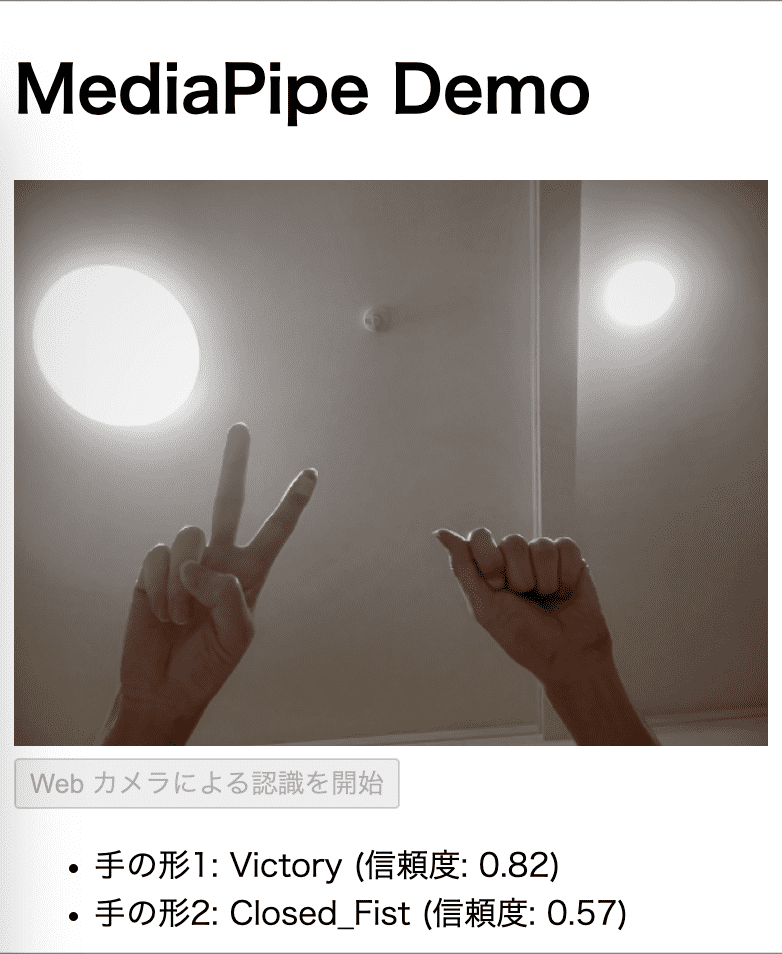

# Svelte + MediaPipe

<div align="center">
  
</div>

This is a demo of gesture recognition using MediaPipe in a Svelte app.
This project was created to illustrate the following web page.

- [Svelte 応用: MediaPipe で Web カメラ映像をジェスチャー認識する｜まくろぐ](https://maku.blog/p/pqmxxqz/)
- [デモページ](https://p-pqmxxqz-svelte-mediapipe.vercel.app/)

## Developing

Once you've created a project and installed dependencies with `npm install` (or `pnpm install` or `yarn`), start a development server:

```bash
npm run dev

# or start the server and open the app in a new browser tab
npm run dev -- --open
```

## Building

To create a production version of your app:

```bash
npm run build
```

You can preview the production build with `npm run preview`.
